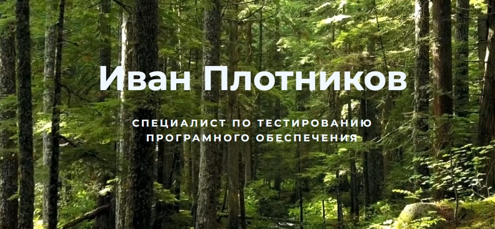

# 

### _Я — QA Engineer_ 

Не боюсь сталкиваться с новыми для себя технологиями, люблю разбираться в деталях и всегда довожу начатое дело до конца. Стремлюсь к возможности совместной работы и обучения в коллективе. Ищу возможность применить свои знания на проекте и быстро влиться в рабочий процесс.

 

##  

    

    

##  

    
    
    
    
    
    
    
    
    
    
    
    
      

 

##  Контакты

    &nbsp;
    &nbsp;
    

 

    

    

